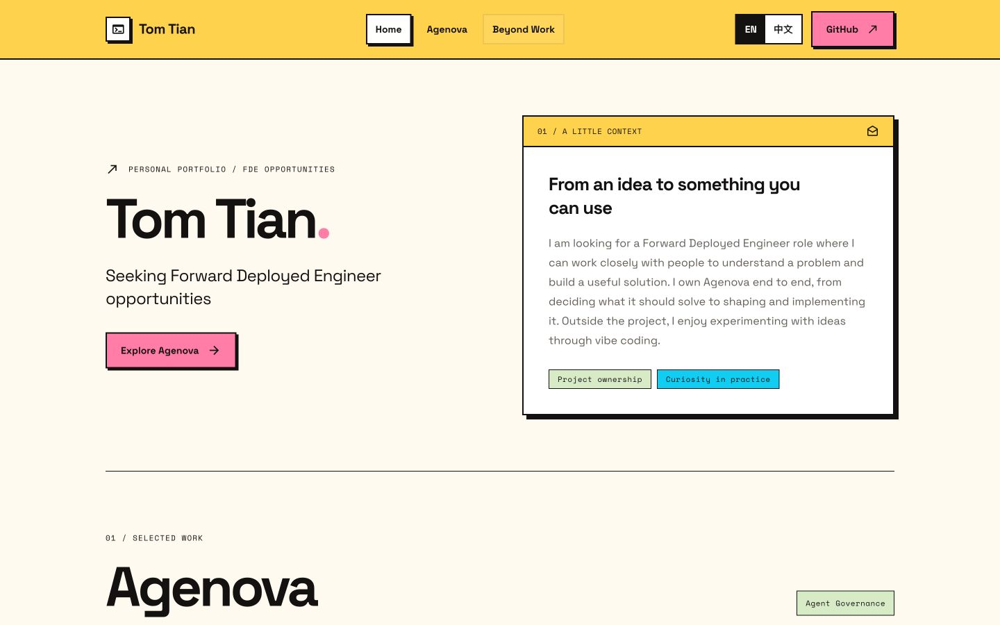
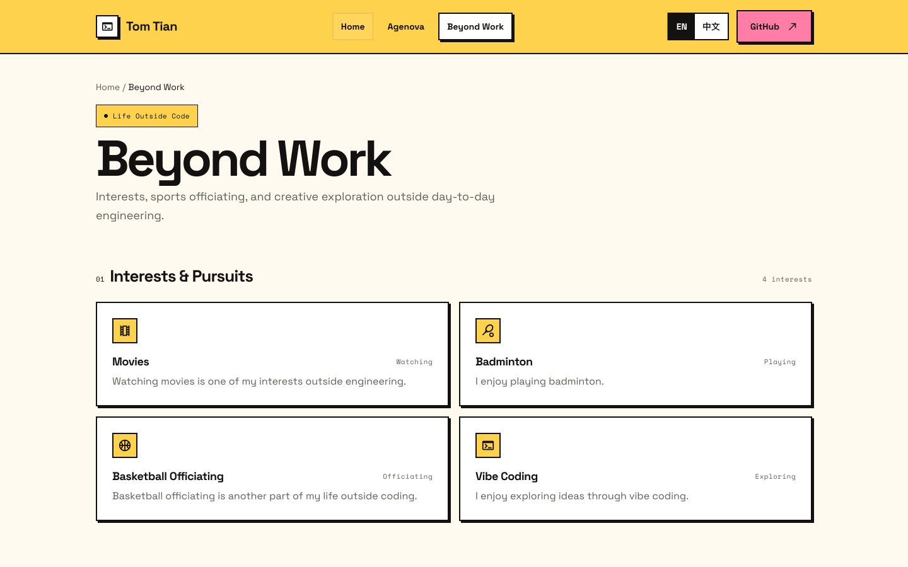

# Tom Tian — Personal Portfolio

**作者：** Tom Tian

**完成状态：** 已实现主要功能，可以运行

## 作品介绍

一个用于自我展示和 FDE 求职的个人网站，展示我整体负责的 Agenova 项目，以及电影、羽毛球、篮球裁判和 vibe coding 等个人兴趣。支持中英文切换，结合明亮配色、AI 兴趣插画、图片浏览和轻量交互，让访客了解我的项目与个性。

[在线体验](https://tom-tian-portfolio.vercel.app)

## 作品截图

[返回作品集总览](../README.md)
