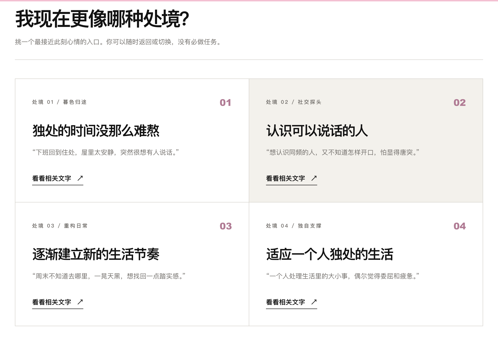
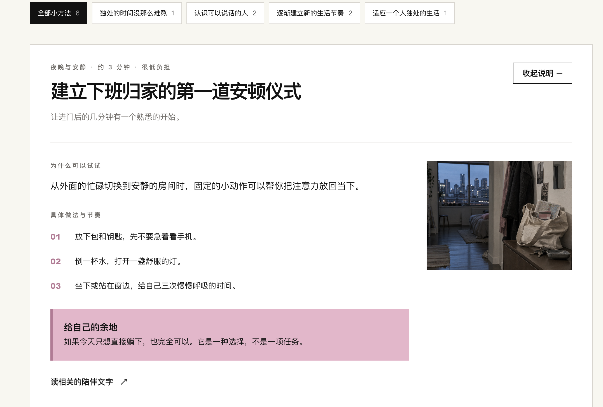

# Woman Growth

**作者：** suzy wang

**完成状态：** 已实现主要功能，可以运行

## 作品介绍

这是一个面向初到陌生城市工作或学习、感到孤单的女性的网站。她们可以根据当下的处境读到被理解的文字，再找到简单、可尝试的小方法，慢慢适应独处，建立新的生活节奏和人与人的连接。

[在线体验](https://woman-growth.vercel.app/)

## 作品截图

[返回作品集总览](../README.md)
