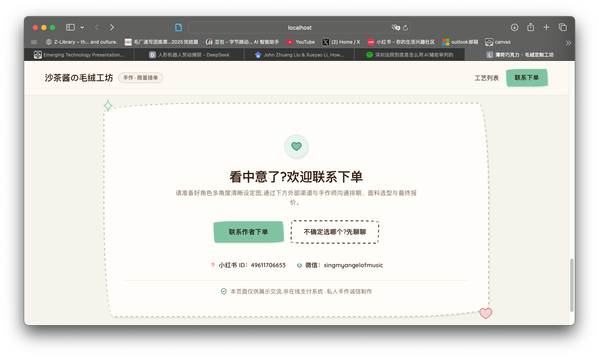

# 沙茶酱の毛绒工坊

**作者：** Rowe

## 作品介绍

这个网站的诞生，是因为一位外国网友想订购我的手作玩偶，私信问我：“Do you have a website for your plush commissions?” Unfortunately，我没有！于是尝试 Vibe Coding 一个。

网站展示了我能提供的手作工艺、例图（部分图片来自小红书）、参考价格、工期，以及联系方式。是真的可以通过联系方式找到我，欢迎找我下单 XD。

## 作品截图

### 手作工艺与参考价格

### 联系与下单

[返回作品集总览](../README.md)
