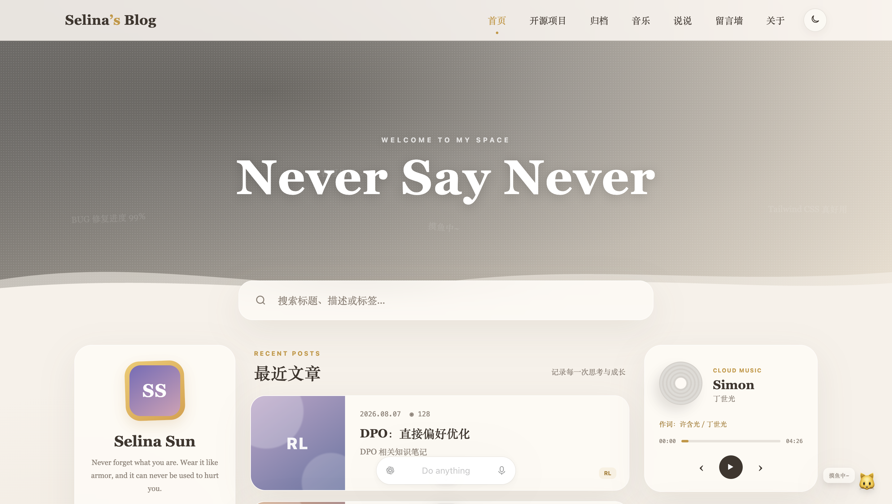
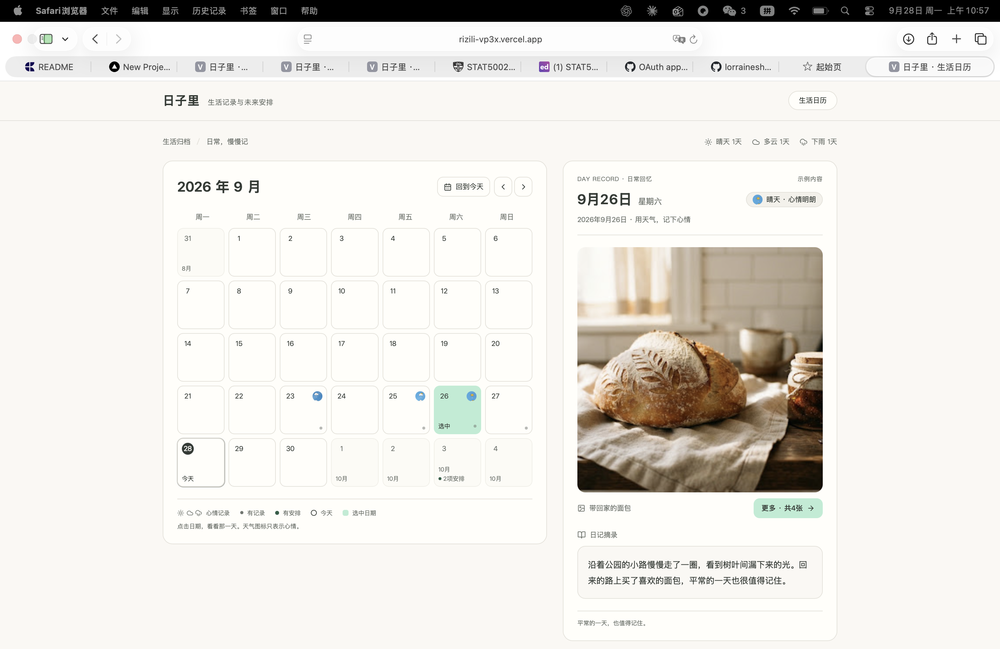
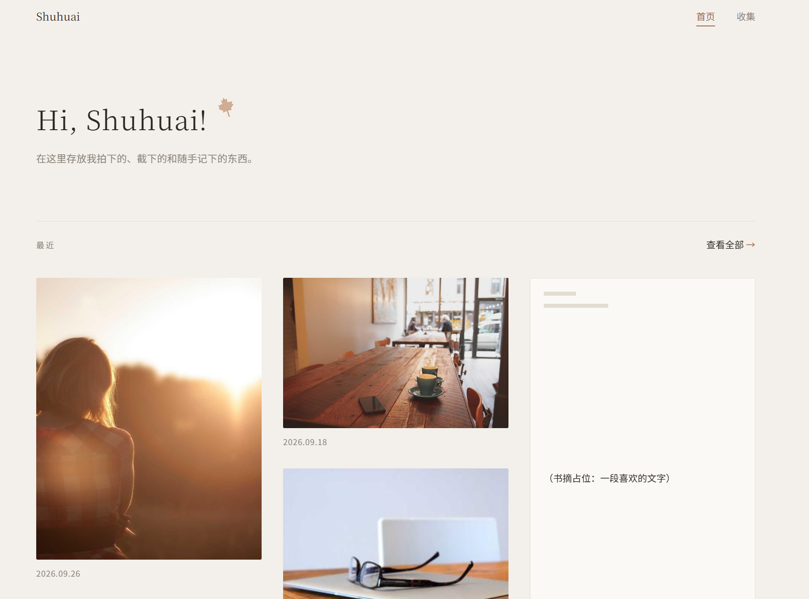
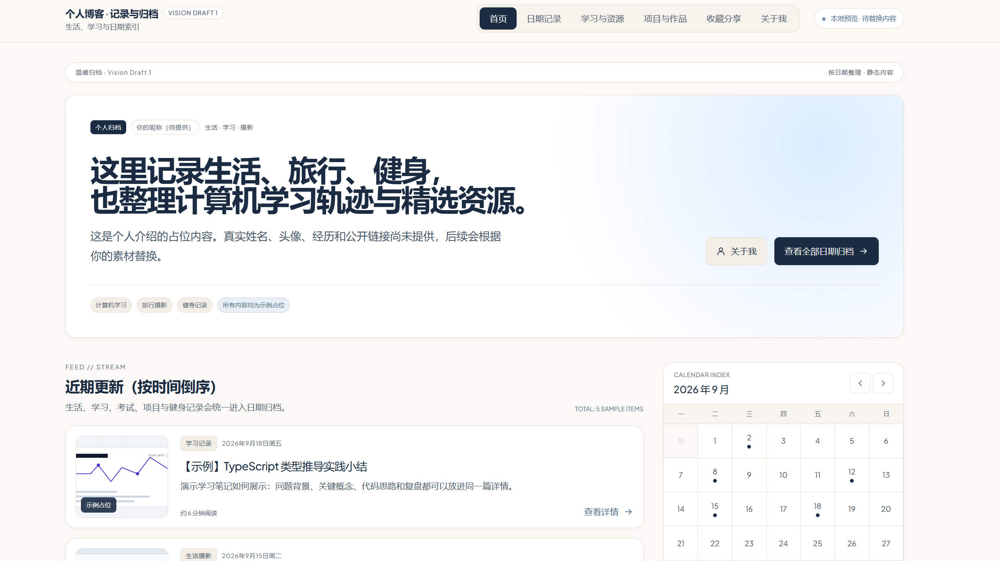
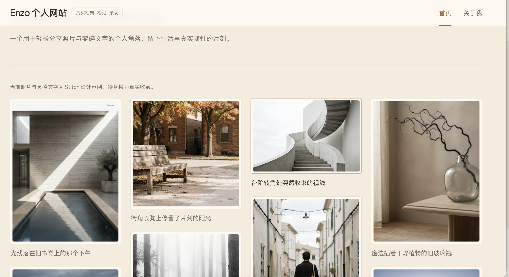
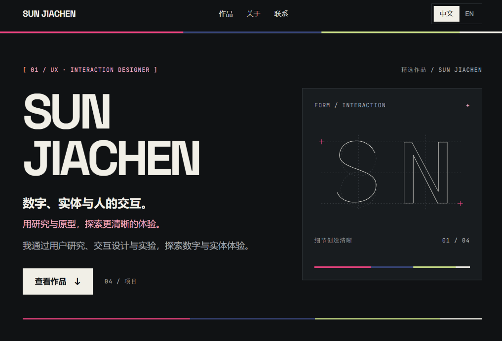
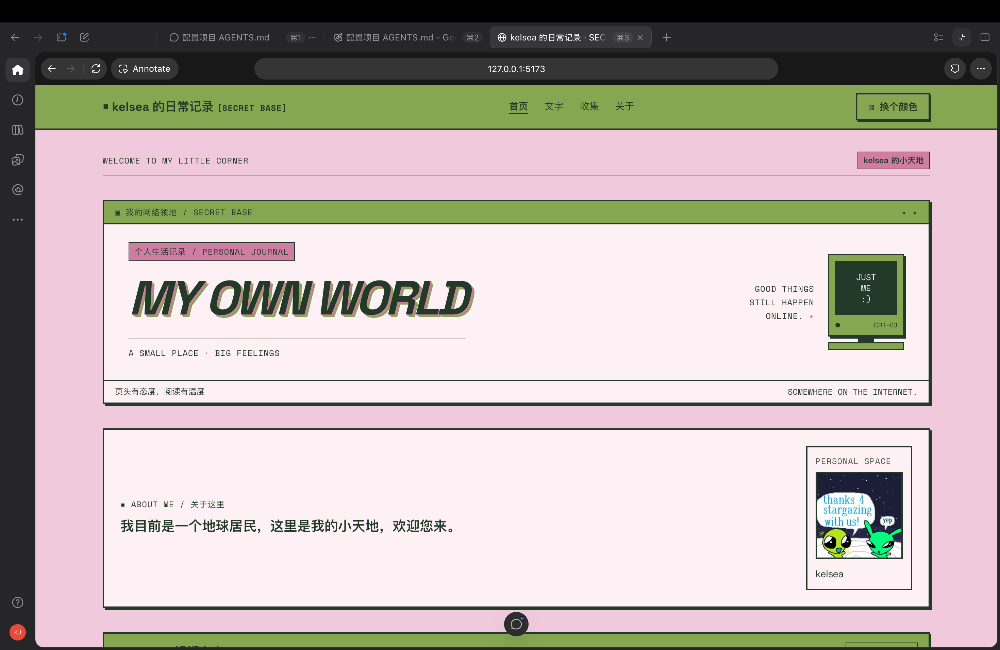
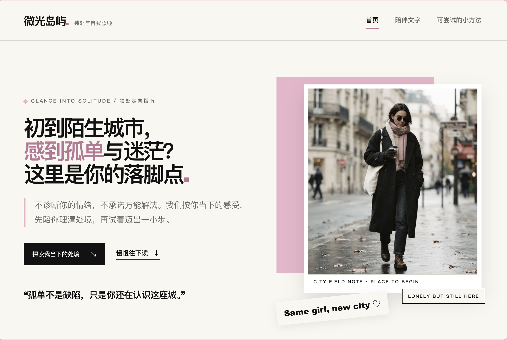
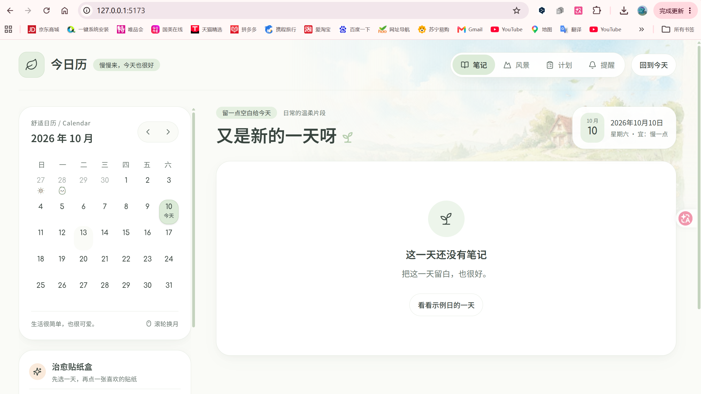
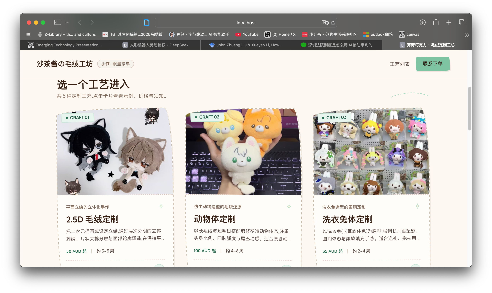

# 第一次 Vibe Coding 工作坊 · 作品集

**Introduction to Vibe Coding: 零基础 AI 编程实战工作坊**

这里收录了同学们在第一次工作坊中提交的作品：个人主页、生活博客、日记、摄影记录、AI 学习助手和手作定制展示。部分作品已经可以运行，部分仍在完善；这些截图记录了大家把想法变成作品的尝试。

共 **19 份作品 · 38 张截图**。作者署名和简介来自作品提交表及后续补充材料；已标注的完成状态来自作者提交。

## 作品目录

| 作品 | 作者 | 截图 |
| --- | --- | --- |
| [Lumi's Room](01-lumi-room/README.md) | 尹瑞雪 | 1 张 |
| [个人主页](02-selina-personal-page/README.md) | Selina Sun | 1 张 |
| [日子里](03-rizili/README.md) | 寿陆蕾 | 2 张 |
| [Tom Tian — Personal Portfolio](04-tom-tian-portfolio/README.md) | Tom Tian | 2 张 |
| [个人回忆记录](05-shuhuai-memories/README.md) | Shuhuai Wang | 2 张 |
| [my_website](06-yunhai-website/README.md) | yunhai Wang | 1 张 |
| [个人生活博客](07-yizhou-life-blog/README.md) | 刘一洲 | 3 张 |
| [YY ai](08-yyai/README.md) | 王舒纯 | 1 张 |
| [my blog](09-xiaoyu-blog/README.md) | Xiaoyu Zhang | 2 张 |
| [myportfolio](10-jiachen-portfolio/README.md) | Jiachen Sun | 1 张 |
| [天赐庄游记](11-tiancizhuang-journey/README.md) | 皮尔东东 | 2 张 |
| [KelsWorld](12-kelsworld/README.md) | kelsea | 2 张 |
| [Ray的个人主页](13-ray-personal-page/README.md) | Yulei Zhou | 3 张 |
| [A Semester in Photos](14-semester-in-photos/README.md) | 吴旸 | 1 张 |
| [个人主页](15-yuri-personal-page/README.md) | Yuri Li | 3 张 |
| [Woman Growth](16-woman-growth/README.md) | suzy wang | 3 张 |
| [个人主页](17-oakley-personal-page/README.md) | Oakley | 3 张 |
| [日子拾光](18-eleven-rizi-shiguang/README.md) | eleven | 3 张 |
| [沙茶酱の毛绒工坊](19-rowe-plush-workshop/README.md) | Rowe | 2 张 |

## 作品展示

### 01｜Lumi's Room

**作者：** 尹瑞雪  
**完成状态：** 已实现主要功能，可以运行

个人网页

[查看全部截图与介绍](01-lumi-room/README.md) · [在线体验](https://lumi-room-site.vercel.app)

---

### 02｜个人主页

**作者：** Selina Sun  
**完成状态：** 已完成部分功能，还在完善

自用，展示个人情况

[查看全部截图与介绍](02-selina-personal-page/README.md) · [在线体验](https://my-vibe-web-omega.vercel.app)

---

### 03｜日子里

**作者：** 寿陆蕾  
**完成状态：** 已实现主要功能，可以运行

一个记录功能的线上日记，可以用天气描述每日心情，限制只能每日编辑的日记功能，同时具备日程与相册功能

[查看全部截图与介绍](03-rizili/README.md) · [在线体验](https://rizili-vp3x.vercel.app)

---

### 04｜Tom Tian — Personal Portfolio

**作者：** Tom Tian  
**完成状态：** 已实现主要功能，可以运行

一个用于自我展示和 FDE 求职的个人网站，展示我整体负责的 Agenova 项目，以及电影、羽毛球、篮球裁判和 vibe coding 等个人兴趣。支持中英文切换，结合明亮配色、AI 兴趣插画、图片浏览和轻量交互，让访客了解我的项目与个性。

[查看全部截图与介绍](04-tom-tian-portfolio/README.md) · [在线体验](https://tom-tian-portfolio.vercel.app)

---

### 05｜个人回忆记录

**作者：** Shuhuai Wang  
**完成状态：** 已实现主要功能，可以运行

给个人使用，专门用于记录时刻，分享时光

[查看全部截图与介绍](05-shuhuai-memories/README.md) · [在线体验](https://web-three-inky-12.vercel.app)

---

### 06｜my_website

**作者：** yunhai Wang  
**完成状态：** 已实现主要功能，可以运行

个人生活记录

[查看全部截图与介绍](06-yunhai-website/README.md) · [在线体验](https://my-website-lyart-five-17.vercel.app/)

---

### 07｜个人生活博客

**作者：** 刘一洲  
**完成状态：** 已完成部分功能，还在完善

给我的好朋友uu们看

[查看全部截图与介绍](07-yizhou-life-blog/README.md) · [在线体验](https://enzolife-j91yrrq2j-moxuan-education.vercel.app)

---

### 08｜YY ai

**作者：** 王舒纯  
**完成状态：** 已实现主要功能，可以运行

YYAI 是一款面向留学生的 AI 学习助手，连接 Canvas 和 Ed，帮你整理课程资料、看懂作业要求，并围绕课程内容随时提问。

[查看全部截图与介绍](08-yyai/README.md) · [在线体验](https://yyai.com.au)

---

### 09｜my blog

**作者：** Xiaoyu Zhang  
**完成状态：** 已实现主要功能，可以运行

自己用，帮助记录生活

[查看全部截图与介绍](09-xiaoyu-blog/README.md) · [在线体验](https://my-blog-ten-ashy-30.vercel.app/)

---

### 10｜myportfolio

**作者：** Jiachen Sun  
**完成状态：** 已实现主要功能，可以运行

我的求职作品集

[查看全部截图与介绍](10-jiachen-portfolio/README.md)

---

### 11｜天赐庄游记

**作者：** 皮尔东东  
**完成状态：** 已实现主要功能，可以运行

个人博客

[查看全部截图与介绍](11-tiancizhuang-journey/README.md) · [在线体验](https://purestone.github.io/journey/)

---

### 12｜KelsWorld

**作者：** kelsea  
**完成状态：** 已完成部分功能，还在完善

我做出来是给自己用来记录生活想法，记录成长的。同时也可以展示给想了解我的人。我最喜欢的部分是我的网页风格 参考了千禧年代的像素网页，保留复古的同时想要跳脱一点，所以初始配色采用粉色和绿色。

[查看全部截图与介绍](12-kelsworld/README.md)

---

### 13｜Ray的个人主页

**作者：** Yulei Zhou  
**完成状态：** 已完成部分功能，还在完善

自己，个人网站

[查看全部截图与介绍](13-ray-personal-page/README.md)

---

### 14｜A Semester in Photos

**作者：** 吴旸  
**完成状态：** 已实现主要功能，可以运行

展示我这个学期里每周随手拍下的一些照片。

[查看全部截图与介绍](14-semester-in-photos/README.md) · [在线体验](https://web1-gomf.vercel.app/)

---

### 15｜个人主页

**作者：** Yuri Li  
**完成状态：** 已完成部分功能，还在完善

给自己用, 帮助记录生活

[查看全部截图与介绍](15-yuri-personal-page/README.md) · [在线体验](https://my-blog-psi-murex.vercel.app/)

---

### 16｜Woman Growth

**作者：** suzy wang  
**完成状态：** 已实现主要功能，可以运行

这是一个面向初到陌生城市工作或学习、感到孤单的女性的网站。她们可以根据当下的处境读到被理解的文字，再找到简单、可尝试的小方法，慢慢适应独处，建立新的生活节奏和人与人的连接。

[查看全部截图与介绍](16-woman-growth/README.md) · [在线体验](https://woman-growth.vercel.app/)

---

### 17｜个人主页

**作者：** Oakley  
**完成状态：** 已实现主要功能，可以运行

让别人快速了解自己

[查看全部截图与介绍](17-oakley-personal-page/README.md) · [在线体验](https://personal-web-oakley3.vercel.app/)

---

### 18｜日子拾光

**作者：** eleven

这是一本可以慢慢翻看和制作的个人日历。选一个日期，看看当天的笔记、风景、计划和提醒，再贴上可爱的心情贴纸，留下值得回看的小小印记。

[查看全部截图与介绍](18-eleven-rizi-shiguang/README.md)

---

### 19｜沙茶酱の毛绒工坊

**作者：** Rowe

因为一位外国网友询问手作玩偶的定制网站，作者尝试用 Vibe Coding 搭建了自己的毛绒工坊。网站展示可提供的手作工艺、例图（部分图片来自小红书）、参考价格、工期和联系方式，方便有兴趣的人了解并联系定制。

[查看全部截图与介绍](19-rowe-plush-workshop/README.md)

---

## 关于本作品集

本作品集仅收录同意社团公开展示与活动宣传的作品。作品及所用素材的权利归相应作者或权利人所有，本仓库收录截图与介绍，不包含参与者提交的源代码。

在线链接由作者提供，网页内容可能持续更新；截图保留提交时的样貌。
